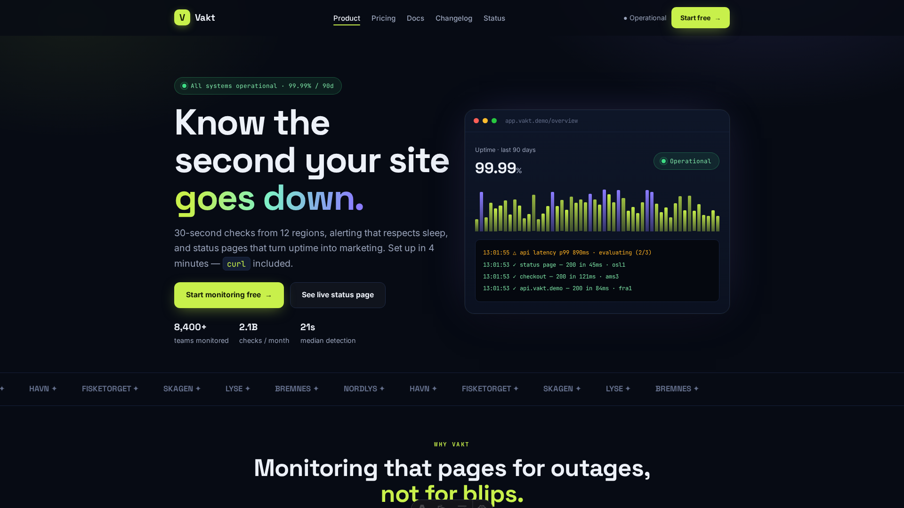
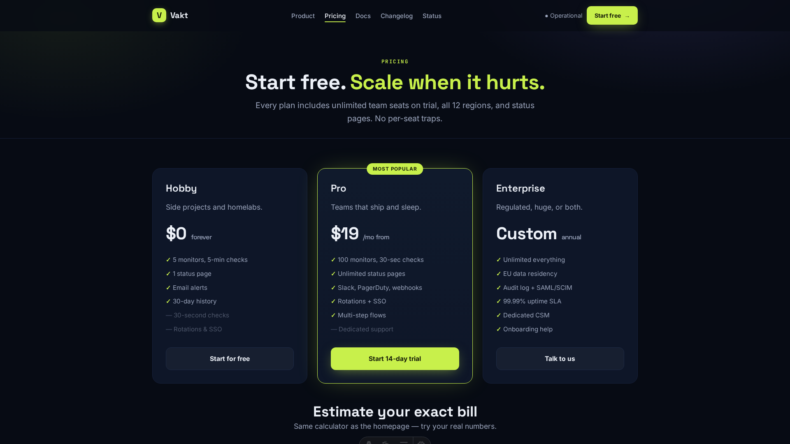
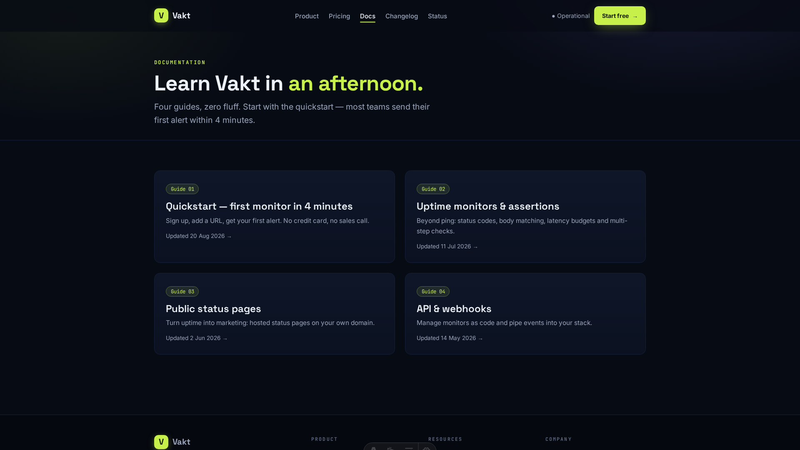
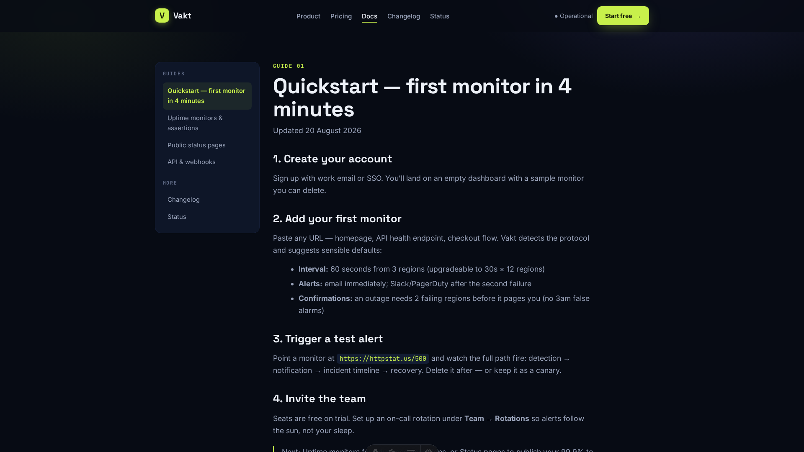
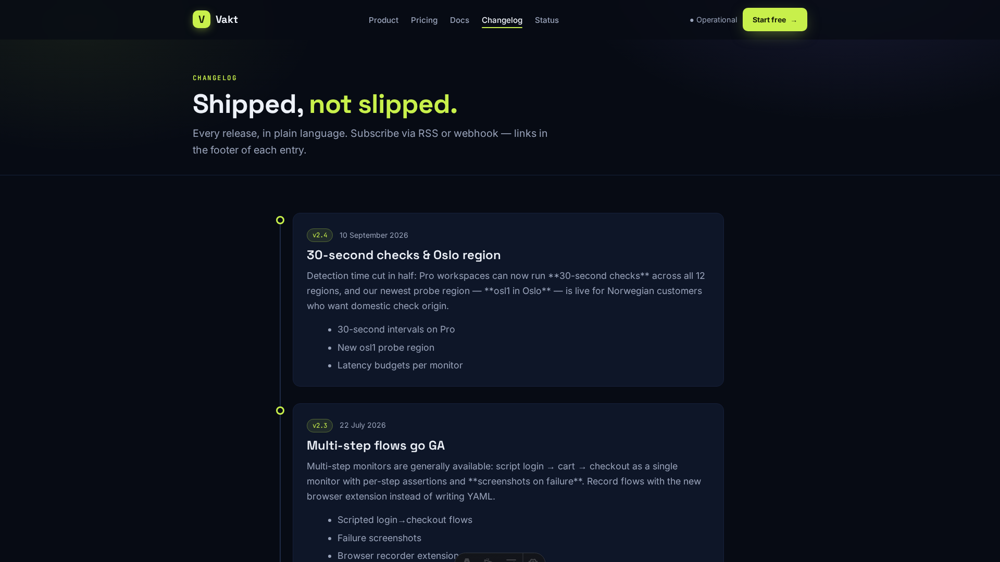
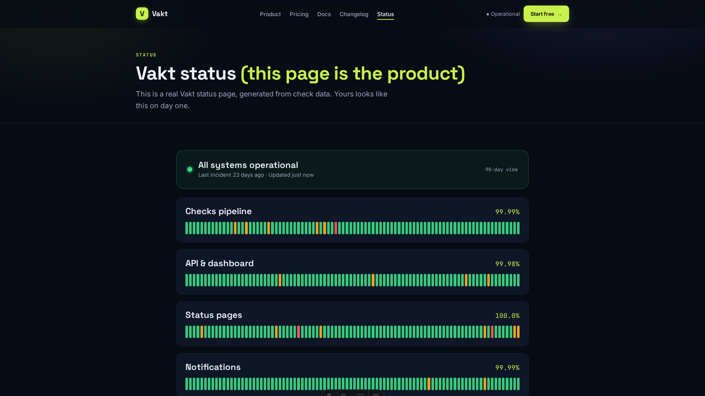
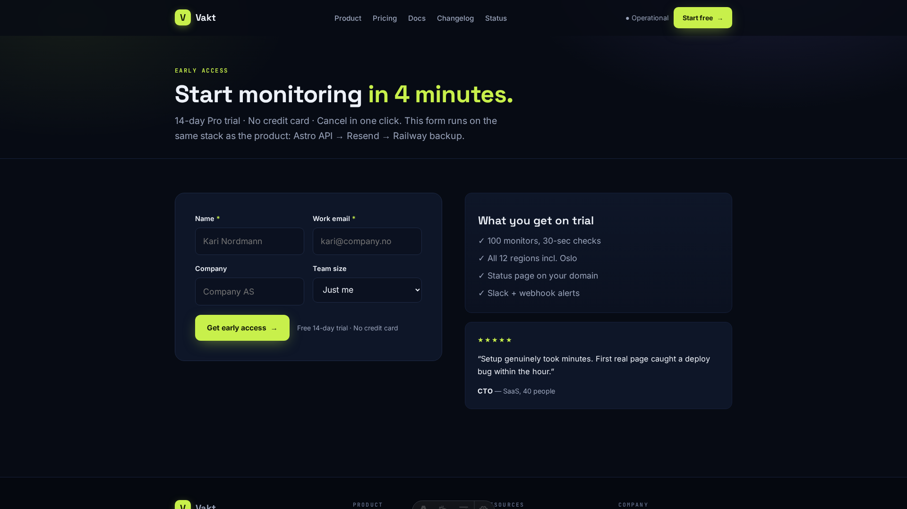
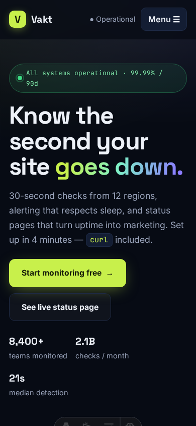
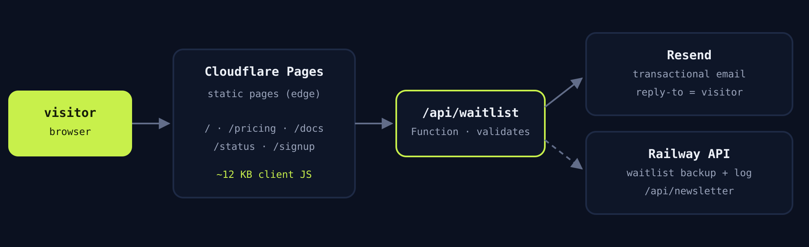

<div align="center">

# Vakt — Uptime-monitoring SaaS in Astro

**Dark, interactive, zero-framework-JS marketing site + docs + changelog + live status page.**

[](https://astro.build)
[](https://pages.cloudflare.com)
[](https://resend.com)
[](https://railway.app)
[](#-verify-it-yourself)

*Project 2 of 2 — built as demonstrable proof for the Astro Developer (Webflow Migrations) application below.*

</div>

---



## 👀 Visual walkthrough — click through the site

Every picture below is a real screenshot of the running site. Follow them in order for the full tour:

### 01 · Homepage hero — a dashboard that feels alive
Animated uptime bars, a cycling live event log, pulsing status pill, proof stats. All vanilla CSS/JS — no framework.


### 02 · Pricing — tiers + interactive calculator
Three plans plus a slider-driven cost estimator (monitors × seats × interval × billing). Try dragging it in the live demo.


### 03 · Docs index — guides as typed collections
Four guides, zero fluff. Each is a Markdown file validated by a Zod schema — bad content fails the build, not the page.


### 04 · Docs guide — sidebar layout with prev/next
Sticky guide nav, prose styling, code blocks, and sequential navigation between guides.


### 05 · Changelog — release timeline
Versioned entries with highlights, newest first — the same collection pattern as a Webflow CMS list.


### 06 · Status page — the product demoing itself
Seeded 90-day uptime bars × 4 components plus incident history. This is what customers get on day one.


### 07 · Signup — waitlist form that you own
Validates inline, honeypot for bots, works with JS disabled → API → Resend email + Railway backup.


### 08 · Mobile 390px — responsive throughout
4 breakpoints, accessible mobile menu, no horizontal scroll, touch-friendly calculator and forms.


---

## 📩 Application: Astro Developer for Webflow Migrations & Ongoing Projects

Hi Nettsidetjenester — I'm **Waleed Azam**, an Astro developer based in Norway (CET — same timezone as your team). Rather than describing my process, I built it twice: two complete Astro projects on your exact stack (Astro · Cloudflare · Resend · Railway · GitHub), both runnable, both reviewable line-by-line. Your four questions, answered:

### 1. Relevant projects (Astro) + what I personally built

**Project A — Fjord & Form: Webflow → Astro migration (this repo's sibling)**
🔗 `https://github.com/Waleed-Azam/Astro-Developer-` — includes a 5-minute video walkthrough + screenshots.
A fictional Stavanger studio's Webflow site rebuilt 1:1 in Astro: 7 templates, 2 CMS collections → typed Markdown, ~200 lines of vanilla-JS interactions (~8 KB shipped, down from ~412 KB of Webflow runtime), contact form → Resend + Railway backup, Cloudflare hybrid deploy, CI that fails on any Webflow-JS leak. I built **everything**: audit script, CSS system, all routes, API, backend, migration playbook, QA checklist, estimation template, video script.

**Project B — Vakt: SaaS marketing site + docs + status (this repo)**
A dark-themed uptime-monitoring SaaS proving range beyond agency sites — see the visual tour above: animated live-dashboard hero, **interactive pricing calculator**, FAQ accordions, docs + changelog as typed content collections, a **90-day status page**, and a waitlist API → Resend + Railway backup. I built **everything**: theme, components, collections, API route, backend integration, CI.

Both repos share one philosophy: static where possible, server where necessary, every line explainable (your AI policy, honoured structurally).

### 2. Experience with Cloudflare and Railway

**Cloudflare** — Pages (repo-connected deploys, `npm run build` → `dist`, Node 20, preview URL per PR), Functions via the Astro Cloudflare adapter (`hybrid` output: static pages + exactly one server route for forms), secrets via dashboard/CLI (`RESEND_API_KEY`, `CONTACT_TO_EMAIL`, `RAILWAY_API_URL` — never in repo), DNS cutover planning with the old Webflow site kept read-only 30 days as rollback. Config: `astro.config.mjs` + `wrangler.toml` in both repos.

**Railway** — zero-dependency Node services from monorepo subfolders (`backend/railway.toml`), `/health` healthchecks, env-var config (`ADMIN_TOKEN`, `ALLOWED_ORIGINS` CORS-locked to the Cloudflare domains), JSONL → Postgres upgrade path documented. In these demos Railway is the **system of record** the form backs up to (4s timeout, failures logged but never user-visible) — I failure-drilled it: backend stopped → form still succeeds.

**Resend** — domain verification flow, `reply_to` = visitor, mock-mode local dev so forms are testable pre-credentials, friendly failure UX. See `src/lib/resend.ts`.

### 3. How I approach migrating a Webflow site to Astro

1. **Audit & freeze** — crawl sitemap/CMS/forms/embeds into a written inventory (my `export-webflow-audit.mjs` script does this); screenshot every breakpoint *including menu-open and error states*; freeze the style guide into CSS tokens; start the redirect map on day one.
2. **Content first** — CMS → typed Markdown collections with Zod schemas, so bad content fails the build instead of silently breaking a page; normalise æ/ø/å slugs with redirects; preserve alt text.
3. **Rebuild section-by-section** — base (layout/header/footer/CSS) → home → CMS templates → inner pages, keeping Webflow class names 1:1 so parity is diffable in DevTools; interactions rewritten in ~200 lines of vanilla JS.
4. **Forms & integrations** — Webflow Forms → API route (shared client/server validation, honeypot) → Resend + Railway backup; every third-party embed re-justified or removed.
5. **QA with evidence** — 4 breakpoints × 3 browsers, keyboard-only pass, Lighthouse ≥95, redirect spot-checks, failure drills (kill backend, revoke email key) — all tracked in my `QA_CHECKLIST.md`.
6. **Launch & handover** — Cloudflare cutover in a low-traffic hour, 48h monitoring, handover pack + walkthrough video.

Fixed scope from the audit, estimates as ranges with explicit buffer, risks flagged in writing. Full depth: `MIGRATION_PLAYBOOK.md` in the sibling repo.

### 4. Availability

Based in **Norway (CET)** — full workday overlap with your team. Available **[immediately / from DATE]** for **[25–35] hrs/week**, async-first with same-day responses during work hours. Happy to start with **one migration as a paid trial**, then scale to ongoing work. First reply within one working day, every PR with screenshots + verification notes so reviews stay fast.

---

## 🚀 Run it (2 minutes)

```bash
npm install
cp .env.example .env   # optional — waitlist runs in mock mode without keys
npm run dev            # → http://localhost:4321
cd backend && npm start  # → :3002 (Railway service; form degrades gracefully without it)
```

## 🗺️ What's inside

| Path | What it shows |
|---|---|
| `src/pages/index.astro` | Hero dashboard mock (seeded animated bars + live event log), features, steps, calculator, testimonials, FAQ |
| `src/components/PricingCalculator.astro` | Interactive sliders + billing toggle, vanilla JS, strict-TS clean |
| `src/content/{docs,changelog}/` | 8 typed Markdown entries → docs with sidebar nav + changelog timeline |
| `src/pages/status.astro` | Status page: seeded 90-day uptime bars × 4 components + incident history |
| `src/pages/api/waitlist.ts` | Validate → Resend → Railway backup; honeypot; native-POST fallback |
| `backend/` | Railway service: `/health`, enquiry/newsletter backup — zero dependencies |
| `docs/screenshots/` | The 9 screenshots used in the visual tour above |
| `.github/workflows/ci.yml` | `check` → build → all-routes smoke test |



## ✅ Verify it yourself

```bash
npm run build        # astro check (strict, 0 errors) + Cloudflare build
ls dist/_astro/*.js  # → ~12 KB total client JS, zero framework
```

- Disable JavaScript: all content, docs, pricing and native form POST still work
- `prefers-reduced-motion` respected; keyboard-only pass on menu, FAQ, calculator, form
- Stop the backend and submit the waitlist: still succeeds (best-effort backup)

## ☁️ Deploy

**Cloudflare Pages:** connect repo → `npm run build` → `dist`, Node 20 → secrets `RESEND_API_KEY`, `CONTACT_TO_EMAIL`, `RAILWAY_API_URL`.
**Railway:** service from `/backend` → `ADMIN_TOKEN`, `ALLOWED_ORIGINS` → healthcheck `/health`.

---

<div align="center">

Built by **Waleed Azam** — Astro developer · Webflow migrations · Norway (CET)

Project A (migration): `github.com/Waleed-Azam/Astro-Developer-` · Project B (SaaS): this repo

</div>
